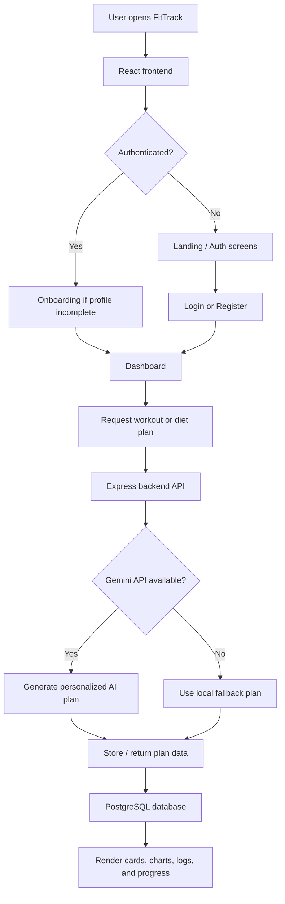

# FitTrack

FitTrack is an AI-powered fitness and nutrition platform designed to help users plan workouts, track meals, monitor progress, and stay consistent with a clean dashboard experience. It combines a React frontend, a TypeScript/Express backend, PostgreSQL persistence, and Gemini AI generation for personalized fitness and diet plans.

Live Demo: [https://fit-track-v0hp.onrender.com](https://fit-track-v0hp.onrender.com)

Author: [](https://github.com/Ankush-0g)

## What FitTrack Does

- Personalized fitness and diet plan generation
- Workout session logging and meal logging
- Progress tracking with charts and stats
- Authentication with onboarding flow
- Admin dashboard for operational visibility
- Gemini AI fallback handling when remote generation is unavailable

## Tech Stack

### Frontend

<p>
    
    
    
    
    
    
    
</p>

### Backend

<p>
    
    
    
    
    
    
    
</p>

## System Workflow



## Project Architecture

FitTrack follows a layered full-stack architecture:

- Presentation layer: React pages and reusable UI components in `src/`
- State and context layer: authentication and theme providers in `src/context/`
- API layer: Express server in `server.ts` handling auth, profile updates, plan generation, and data retrieval
- Service layer: Gemini prompt builders, AI fallback logic, and request orchestration in `server/`
- Data layer: PostgreSQL tables for users, plans, logs, progress, and admin activity

### Core Structure

- `src/pages/` contains the main user screens such as dashboard, onboarding, fitness, diet, progress, and admin views
- `src/components/` contains the reusable UI blocks such as cards, charts, calendar controls, toggles, and logging panels
- `server/` contains database setup, prompt generation, and offline fallback logic
- `server.ts` boots the API, initializes the database, and connects the frontend to backend services

## Gemini AI Integration

FitTrack uses Gemini AI to generate personalized fitness and nutrition content based on the user profile, goals, equipment, and activity data.

- Fitness plan generation is handled through prompt-driven JSON responses
- Diet plan generation creates meal plans with calorie and macro targets
- If the Gemini key is missing, invalid, blocked, or unavailable, FitTrack falls back to local program generation so the app still works
- The backend expects `GEMINI_API_KEY` in the environment and uses the Gemini model configured in the server

## Local Development

### Prerequisites

- Node.js
- PostgreSQL database access if you want to run with your own database
- Gemini API key

### Setup

1. Install dependencies:

```bash
npm install
```

2. Create a `.env.local` file and set the required values:

```bash
GEMINI_API_KEY=your_gemini_api_key
DATABASE_URL=your_postgres_connection_string
JWT_SECRET=your_jwt_secret
```

3. Start the app:

```bash
npm run dev
```

## Build And Run

```bash
npm run build
npm start
```

## Notes

- The app includes authentication, onboarding, admin views, and workout/diet tracking flows.
- Database tables are initialized automatically on startup.
- If Gemini is unavailable, the UI still remains usable through fallback content.
